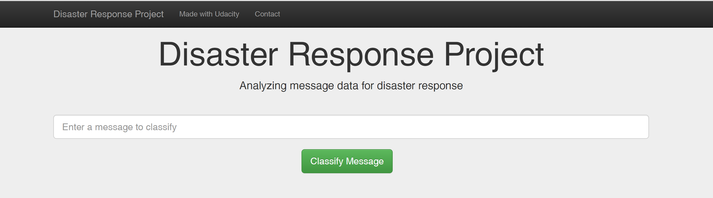
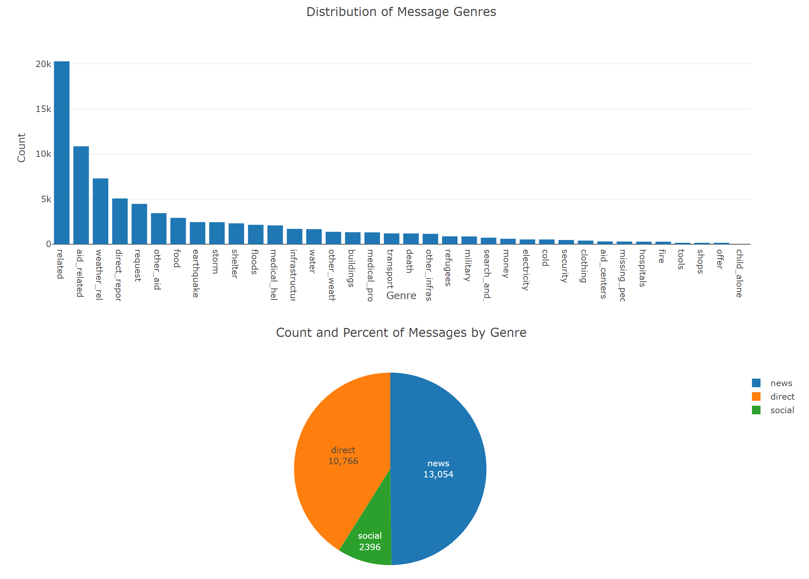
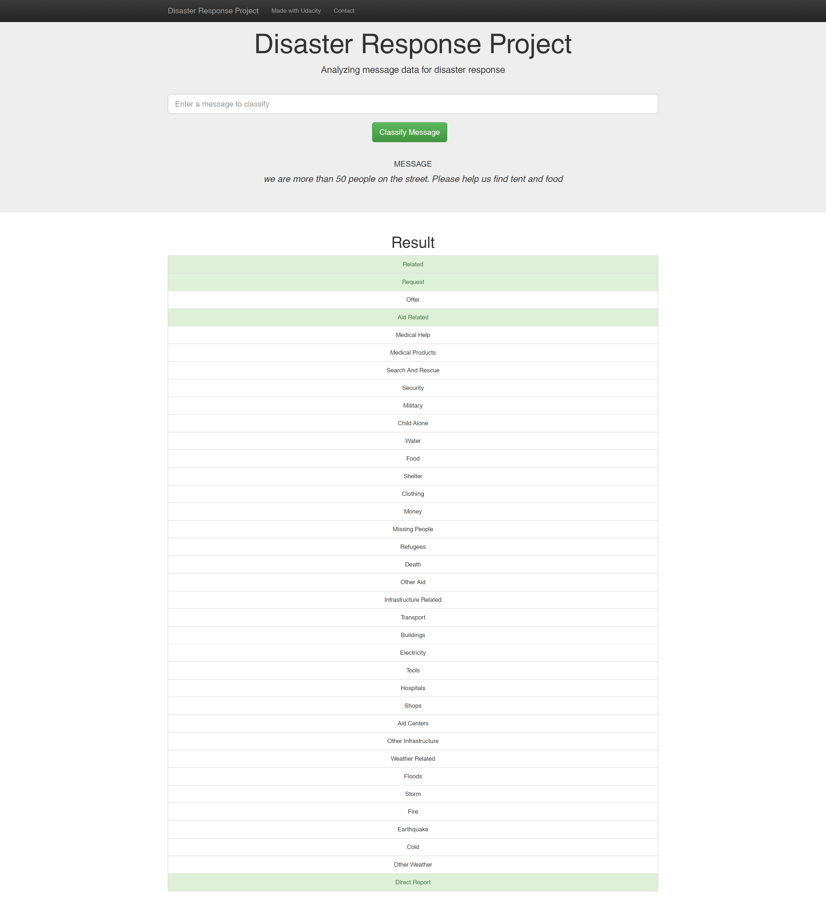

## Table of Contents
1. [Description](#description)
2. [Dependencies](#dependencies)
3. [Executing Program](#execution)
4. [Files](#files)
5. [Authors](#authors)
6. [License](#license)
7. [Screenshots](#screenshots)

## Description

This Project analyzes disaster data from Figure Eight to build a model for an API that classifies disaster messages. The project builds a Natural Language Model Processor (NLP) to classify messages provided by the user. 

I used 26248 real disaster messages to train the model into 36 different genres. 

The project comprises of the following steps:
1. ETL Pipeline
* Loads the messages and categories datasets
* Merges the two datasets
* Cleans the data
* Stores it in a SQLite database

2. ML Pipeline
In a Python script, train_classifier.py, write a machine learning pipeline that:
* Loads data from the SQLite database
* Splits the dataset into training and test sets
* Builds a text processing and machine learning pipeline
* Trains and tunes a model using GridSearchCV
* Outputs results on the test set
* Exports the final model as a pickle file

3. Flask Web App
* Data visualization on message data genres
* Input text which classifies the text into applicable genres

## Dependencies

* Python 3.5+
* Machine Learning Libraries: NumPy, SciPy, Pandas, Sciki-Learn
* NLTK Libraries: punkt', 'wordnet', 'averaged_perceptron_tagger', 'stopwords, 'WordNetLemmatizer'
* Database: SQLalchemy
* Model Loading and Saving Library: Pickle
* Web App and Data Visualization: Flask, Plotly

## Executing Program

1. Run the following commands in the project's root directory to set up your database and model.

    - To run ETL pipeline that cleans data and stores in database
        `python data/process_data.py data/disaster_messages.csv data/disaster_categories.csv data/DisasterResponse.db`
    - To run ML pipeline that trains classifier and saves
        `python models/train_classifier.py data/DisasterResponse.db models/classifier.pkl`

2. Run the following command in the app's directory to run your web app.
    `python run.py`

3. Go to http://0.0.0.0:3001/

## Files

 - app
 |- static
 | |-style.css #style sheet to override existing stylesheets
 | - template
 | |- master.html  # main page of web app
 | |- go.html  # classification result page of web app
 |- run.py  # Flask file that runs app
 
 - data
 |- disaster_categories.csv  # data to process 
 |- disaster_messages.csv  # data to process
 |- process_data.py #data cleaning and save
 |- DisasterResponse.db   # database to save clean data to
 
 - models
 |- train_classifier.py #model creation
 |- classifier.pkl.7z  # saved model (zipped as it is 28 MB)

## Authors

* Anuja Jadhav (https://www.linkedin.com/in/anuja-jadhav-80632a54/)

## License
Apache License 2.0

## Screenshots

1. Visualizations of test messages

2. Result of a classification text

